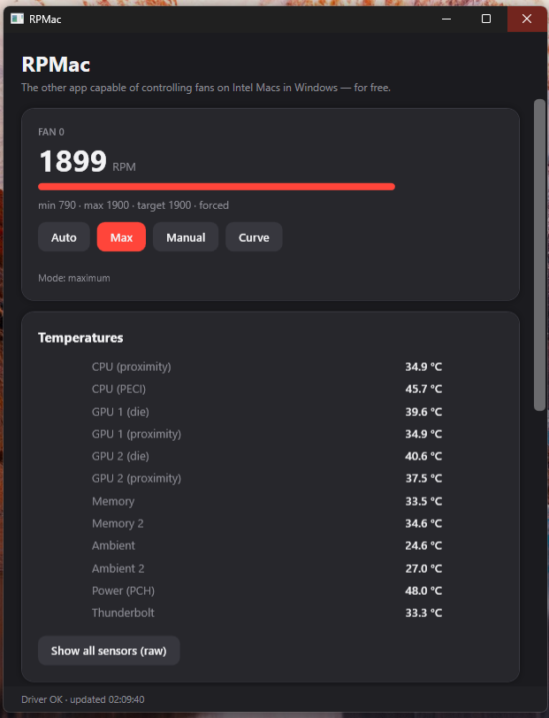
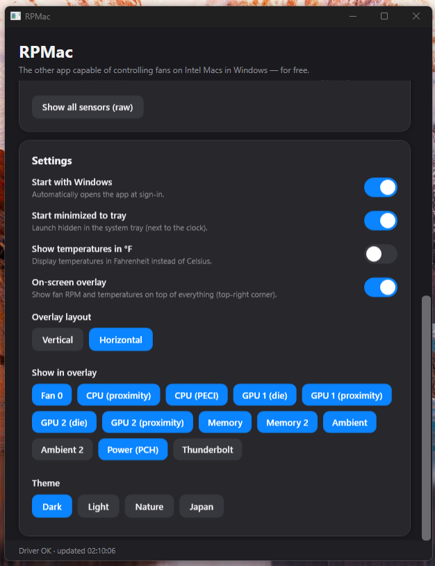
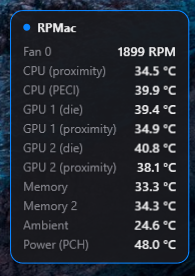
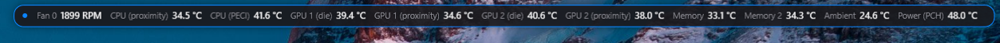

# RPMac

**The other app capable of controlling fans on Intel Macs in Windows — for free.**

RPMac is a free and open-source fan-control utility for **Intel-based Macs running Windows via Boot Camp**. It talks directly to the Mac's **SMC (System Management Controller)** to monitor fan speeds and temperatures, and lets you set each fan to **Automatic**, **Maximum**, or a **custom RPM**.

Designed as a lightweight, modern alternative to paid tools, RPMac includes **hardware safety checks**: it stays read-only on non-Apple hardware and never disables the SMC's built-in thermal protection.

## Screenshots

<table>
  <tr>
    <td align="center" width="50%">
      <br>
      <sub><b>Fan control & live temperatures</b><br>Auto · Max · Manual · Curve, per fan</sub>
    </td>
    <td align="center" width="50%">
      <br>
      <sub><b>Settings, overlay options & themes</b><br>Start with Windows · °C/°F · Dark/Light/Nature/Japan</sub>
    </td>
  </tr>
</table>

**On-screen overlay** (FRAPS-style, always on top — works over games in borderless/windowed mode):

<table>
  <tr>
    <td align="center">
      <br>
      <sub><b>Vertical</b></sub>
    </td>
    <td align="center">
      <br>
      <sub><b>Horizontal (compact)</b></sub>
    </td>
  </tr>
</table>

## Features
- Real-time fan RPM and temperature monitoring
- Per-fan control: Auto / Max / custom RPM / **temperature curve**
- **Per-fan temperature curve** — pick a sensor and ramp RPM between a min and max temperature
- Command-line tool (`smccore.exe`) for scripting fan control
- Curated, friendly temperature sensors (plus a raw view of every key)
- On-screen overlay (FRAPS-style): always-on-top, top-right corner, vertical or horizontal, with selectable fans/sensors
- Themes: Dark / Light / Nature / Japan
- Temperatures in °C or °F
- Start with Windows + start minimized to tray
- Remembers your settings and re-applies them (including after sleep/resume)
- Safety first — read-only unless it confirms a genuine Apple Mac with a valid SMC; clamps RPM to the SMC's own min/max
- Lightweight modern UI — nothing extra to install
- Free and open source (GPL-2.0)

## Install
No installer needed — it's a portable app.

1. Go to the [**Releases**](https://github.com/golirt1/RPMAC/releases/latest) page and download `RPMac-v1.2.0-windows.zip` (under **Assets**).
2. **Unzip it** to any folder you like (e.g. your Desktop). Keep `RPMac.exe`, `smccore.exe` and `inpout32.dll` **together in the same folder**.
3. **Right-click `RPMac.exe` → "Run as administrator"** (administrator rights are required to access the Mac's hardware/SMC).
4. Set each fan to **Auto / Max / a custom RPM**. Temperatures update live.

> **Antivirus note:** RPMac bundles **InpOut32**, a low-level I/O driver needed to talk to the SMC. Some antivirus tools flag this kind of driver as "potentially unwanted" because it grants hardware access — this is normal for fan-control utilities. The full source is in this repo; allow it if your AV blocks it.

To **uninstall**, just delete the folder. Settings live in `%APPDATA%\RPMac`; if you enabled "Start with Windows", turn that toggle off first (or delete the `RPMac` scheduled task).

## Compatibility
| Hardware | Status |
|---|---|
| Intel Macs (up to 2017) on Boot Camp | Should work (tested on MacPro6,1 and MacPro3,1) |
| Intel Macs with T2 (2018-2020) | **Not working yet** — the T2 uses a different SMC interface; support is in progress |
| Apple Silicon (M1+) | Not possible (no Boot Camp) |
| Non-Apple PCs | Read-only (writes are blocked) |

### Tested hardware
RPMac has been verified on **two machines**:

- **Mac Pro (Late 2013)** — model identifier `MacPro6,1`
  - Intel Xeon CPU, dual AMD FirePro GPUs, single centrifugal system fan
  - SMC fan/sensor values in `fpe2` format, I/O base `0x300`
- **Mac Pro (2008)** — model identifier `MacPro3,1`
  - Older Boot Camp in BIOS/CSM mode (where the Windows BIOS strings can be empty or lack "Apple") — RPMac still detects it via the SMC itself

On both machines, reading sensors and controlling the fans (Auto / Max / custom RPM) work correctly.

### Other Intel Macs (untested, but expected to work)
Beyond the two Mac Pros above, RPMac has **not** been tested on other Mac models yet. That said, it is built on the **standard Apple SMC interface that is common to virtually all Intel Macs**, and the core auto-detects the number of fans and each key's data format. So it *should* work on most Intel Macs in Boot Camp, with these caveats:

- **Fan control** is the most portable part (it uses standard keys), so it has the highest chance of working everywhere.
- **Temperature sensor names vary by model**, so on other Macs some labeled sensors may be missing or wrong (use "Show all sensors (raw)" to see everything).
- **T2 Macs (2018-2020) are not supported yet.** The T2 chip intercepts the legacy SMC interface, so RPMac can't read the SMC and stays read-only on these machines. A fix that reaches the SMC through a signed kernel driver (PawnIO) is in progress.
- If the SMC does not respond with plausible values, RPMac **automatically stays read-only** and writes nothing.

## Help us test it

RPMac has only been verified on a couple of Macs, so **we would really appreciate your help confirming whether it works on yours** — whether it works *or not*. Every report helps build a reliable compatibility list.

Please **open an issue** with:

- **Mac model and year** (e.g. "MacBook Pro 15-inch, 2015")
- **Model identifier** (e.g. `MacPro6,1`) — find it in macOS under Apple menu > About This Mac > System Report, or on Windows in System Information
- **CPU and GPU** (e.g. Intel Core i7, AMD Radeon)
- **Number of fans** RPMac detected
- **Windows version**
- **What worked / what didn't** — did fan control (Auto / Max / custom RPM) work? Were the temperatures correct?
- Any error messages or odd readings (a screenshot is great)

Even a quick "works fine on my iMac 2017" is hugely valuable. Thank you!

## Scripting / command line

The release also includes **`smccore.exe`**, a small command-line tool for the same
SMC control, so you can drive the fans from scripts, Task Scheduler, etc. Run it from
an **administrator** terminal, with `inpout32.dll` in the same folder:

```
smccore.exe list              show all fans (RPM, min, max, target)
smccore.exe temps             show fans + temperature sensors
smccore.exe auto              return ALL fans to automatic
smccore.exe max               force ALL fans to maximum
smccore.exe set 2000          set ALL fans to 2000 RPM
smccore.exe auto 0            return fan 0 to automatic
smccore.exe max 0             force fan 0 to maximum
smccore.exe set 0 2000        set fan 0 to 2000 RPM
smccore.exe key TC0D          dump a raw SMC key
```

Fan numbers are `0 .. N-1` (see `list`). RPM values are clamped to each fan's own
min/max. Like the GUI, it stays read-only and writes nothing on non-Apple hardware.

> Prefer the GUI? Each fan has a built-in **temperature curve** (the "Curve" button) that
> ramps RPM between a min and max temperature on a sensor you choose. The command line is
> there for scripting/automation; you can also build your own ramp with `temps` + `set`.

## How it works
RPMac uses the public Apple SMC protocol (the same one documented in the Linux `applesmc` driver) over the SMC's I/O ports (`DATA = 0x300`, `CMD = 0x304`), via the InpOut32 ring-0 I/O bridge. It reads and writes standard SMC keys (`FNum`, `F<n>Tg`, `FS! `, temperature `T...` keys) and auto-detects each key's data type (`fpe2`, `flt`, `ui*`, `sp*`, ...).

## Requirements
- An Intel Mac running Windows (Boot Camp)
- Administrator rights (required for hardware I/O)

## Build
Compiles with the .NET Framework C# compiler already present on Windows — no Visual Studio needed:
```
csc /noconfig /target:winexe /platform:x86 /win32manifest:src\gui\app.manifest /out:build\RPMac.exe ^
    /reference:System.dll /reference:System.Core.dll /reference:System.Xaml.dll ^
    /reference:WPF\WindowsBase.dll /reference:WPF\PresentationCore.dll /reference:WPF\PresentationFramework.dll ^
    src\gui\Smc.cs src\gui\App.cs
```
`inpout32.dll` must sit next to `RPMac.exe`.

## License
**GPL-2.0-only.** See `LICENSE`.

RPMac's SMC code is derived from the Linux `applesmc` driver and smcFanControl — see `NOTICE` for credits. InpOut32 is bundled under the MIT license.

## Credits
- `applesmc.c` (Linux): Nicolas Boichat, Henrik Rydberg
- smcFanControl: Hendrik Holtmann
- InpOut32: Phillip Gibbons

## Disclaimer — no warranty

RPMac is provided **"AS IS", without warranty of any kind**, express or implied, including but not limited to the warranties of merchantability and fitness for a particular purpose, as stated in the GNU GPL-2.0.

- **There is no guarantee that it will work on your Mac.** It has only been tested on one model (see above).
- **You use this software entirely at your own risk.**
- The author and contributors are **not responsible or liable for any damage** of any kind — including but not limited to overheating, throttling, hardware failure, data loss, or any other problem — arising from the use or misuse of this software.

Notes on safety:
- Running the fan at maximum is safe for the hardware itself, but **constant maximum speed increases noise, dust buildup and bearing wear** over time.
- RPMac **never disables the SMC's built-in hardware thermal protection** — the SMC can still override the fans and throttle or shut down the machine to prevent overheating.
- Setting a fan too low under heavy load could let the machine run hot; RPMac clamps manual values to the SMC's own minimum/maximum, but use manual mode with care.
